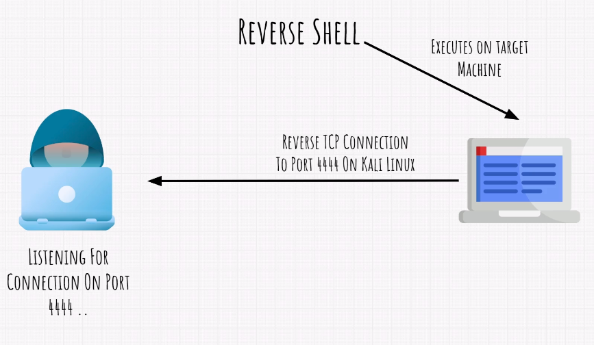
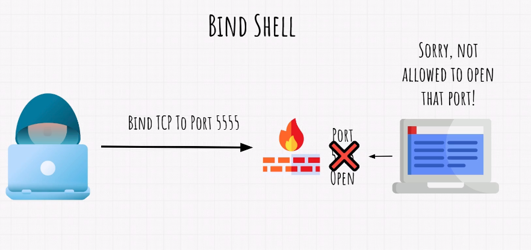

# Exploitation

The exploitation consists in executing some payload in the target through a vulnerable software running in an open port so that we can gain access to the target and execute whatever we want.

If the target is secure (software is secure and up to date), we would need social engineering instead of exploit to trick the user to execute our payload  
Malicious e-mail, usb pen-drive

## Vulnerability

If your software is hosted on an open port, it is also open for possible attacks.

**Exploitable Vulnerability:** The attacker could use the softwares bugs to make the software act in a way it is not supposed to

**Zero-day vulnerability:** A vulnerability that is already in production and the developers have "Zero days" to fix it.

## Searchsploit

- Search available exploits for a software  
`searchsploit `

## Reverse Shells & Bind Shells

### Reverse Shell

### Bind Shell

## Metasploit

Metasploit is a framework for ethical hacking. It comes in Kali linux built in.

**How to access Metasploit source code:** `cd /usr/share/metasploit-framework`

It has 7 modules with exploits, payloads and so much more...

**Good payload to send to the target:** meterpreter shell + reverse tcp connection

**Metasploit modules:**

- auxiliary
- encoders
- evasion
- exploits
- nops
- payloads
- post

The auxiliary module has things like scanners, useful sometimes to gather the software version when nmap couldn't discover it  

### Metasploit CLI

Type `msfconsole` to access the CLI

List available modules: `show {exploits|payloads|...}`

Search: `search {string}`

Set exploit: `use exploit/{PATH}`

Show params the exploit requires: `show options`  
 
Run: `run`

Show available shells: `sessions`

### Some usages:

- Brute force attacks

## Attacking Windows 7 Machine  

### Set up vulnerable machine

- Download Windows 7 image and create a VM  
- Disable updates in the installation wizard  
- Disable firewall  

Eternal Blue Attack